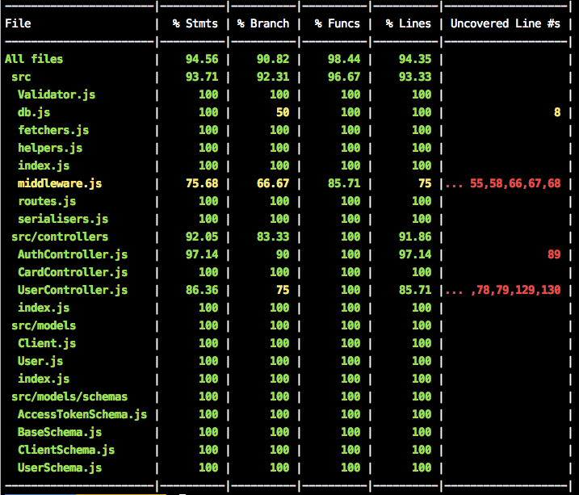
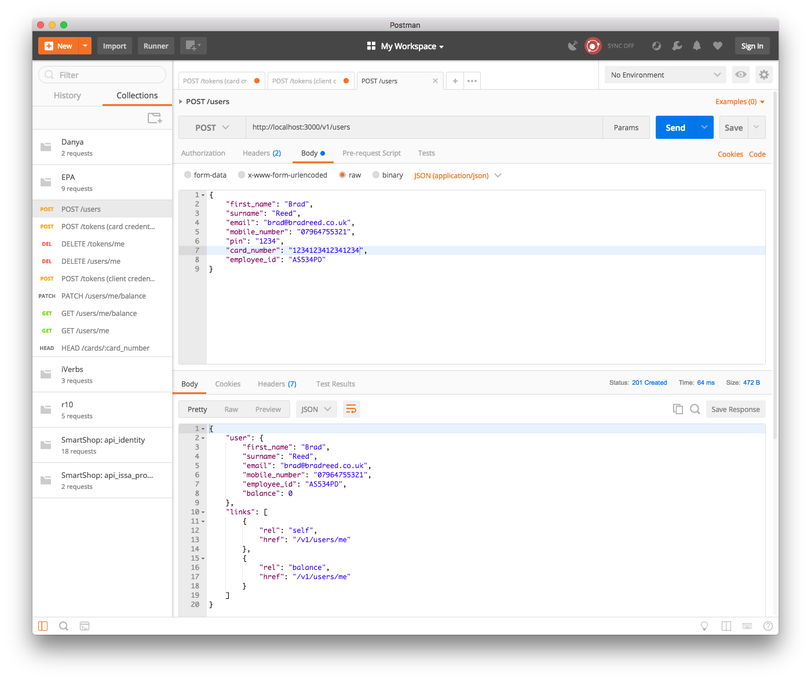

# First Catering Ltd: Card Credit API
This API can be used for employees at firms catered for by First Catering Ltd to top up their cards and spend money 
on-site, using the provided Kiosk machines.

It is written in Javascript using Node 9.7 and Express 4.13.

## Setup

### Installation
1. Clone the repository
2. Run `npm install` to install Node dependencies required by the application
3. Copy `config.example.json` to `config.json` and fill out the blank config items
4. Run the tests using `npm test` and `npm run e2e-test` to ensure everything is working

#### Running the Development Server
This will run the development server on `localhost:3000`. This server is NOT suitable for production as it transpiles
the code on the fly using Babel.
```commandline
$ npm start
```

#### Running the Production Server
Build and run the project. On a real production server, it is recommended to use a Node process manager such as PM2 and 
a reverse proxy such as Nginx for performance reasons.  
In production, it is also highly advisable to set up automated backups of the database in case of failure, as without
this there would be no way of recovering the balances of all the users.
```commmandline
$ npm run build
$ npm run serve
```
or, as a shortcut
```commandline
$ npm run build-and-serve
```

## Implementation
Please see the API Blueprint file at `apiary.apib` for detailed documentation on the endpoints and how to call them.

Most actions require a valid OAuth Bearer token, except the action of obtaining a token itself. There are two kinds of tokens.
1. `client` - Token for the Kiosk machine. Used for registering users, and checking if cards are registered.
These tokens are valid for (by default) 3 hours.
2. `user` - Token for a logged in Employee. Used for checking and updating balance, and removing their account.
These tokens are valid for (by default) 5 minutes.

These Bearer tokens should be sent in the `Authorization` header when making authenticated requests, for example:
```
POST /v1/users
Authorization: Bearer the-token-here
```

When the Kiosk boots, it should `POST /v1/tokens` with its client ID and secret to obtain a `client` token, which it
should store in memory to be used for subsequent requests. If an expired token is used to make a request, the server will
respond with `401 Unauthorized`, and the Kiosk will need to obtain a new one. A token's expiry date is automatically
updated with every request, so the tokens will not expire unless there has been no activity for 3 hours.

When a user taps their card on the card reader, the Kiosk should `HEAD /v1/cards/:card_number` with the read card number,
to check if it is registered in the system. The API will respond with `200 OK` if it is, and `404 Not Found` if it is not.

### Registration
If the card was not found (`404 Not Found`), then the Kiosk should display a form prompting the user to input their details
to sign up. This includes:
- First name
- Surname
- Employee ID
- Mobile Number
- Email Address
- PIN

This data (along with the card number) should then be `POST`ed to `/v1/users` to create a new user. This will respond with either `200 OK` if it
succeeded, or `400 Bad Request` if there were validation issues with the submitted data.  
After the user has been created, an access token should be generated for them and they should be shown the 'welcome' screen.
 

### Topping Up

If the card was found (`200 OK`), then the user should be prompted to enter their PIN, which should then be used to
obtain a token by calling `POST /v1/tokens`. The API will respond with `201 Created` and an access token if the PIN
was correct, and `400 Bad Request` if not.

The Kiosk should then `GET /v1/users/me` with the user's access token to get their account information, and display
this a 'welcome' screen.  
This screen should have:
- a **top-up** button which will prompt the user to pay money (using cash or card), and then
`PATCH /v1/users/me/balance` with the balance to add.
- a **logout** button, which will call `DELETE /v1/tokens/me` to invalidate the user's access
token and log them out

### Spending Money
When the user wishes to spend money at an outlet (eg. cafe, vending machine), they should tap their card and enter their PIN.
This will be used to generate an access token for them (`POST /v1/tokens`), and then a request to `PATCH /v1/users/me/balance`
should be made with a negative value to deduct money from their balance.

## Maintenance

### Adding New Clients
Run the `newclient` task, passing the name of the client.
This will generate a new set of keys which can be used for a second kiosk or different company.  
**Example:**
```commandline
$ npm run newclient -- Bows Kiosk
``` 
**Output:**   
Success
```
Created client 'Bows Kiosk'
Client ID: f98a6f71d96631e375c1871fb45053c7
Client Secret 789bbc56b3f75f674140d65662b16516
```
Failure (if a client with the same name already exists)
```
Error saving client: Client with name 'Bows Kiosk' already exists.
```

### Contributing
When adding new functionality, please ensure that it is fully tested and the documentation is updated for and new or 
changed endpoints. The linter and tests will automatically run when you commit new code to ensure that the API continues
to function as it should.

Below is a brief overview of the structure of the application:
- `controllers` - Contain the code for handling requests. A controller is a file made up of several *handler* functions
- `schemas` - Describe the structure of the data in the database, some validation and methods
- `models` - Wrapper around a Schema that represents an instance of a document in the database
- `scripts` - Scripts used by the `manage.js` script, for instance for adding new clients
- `db.js` - Handles the connection to the MongoDB server
- `fetchers.js` - Contains helper functions for querying the database
- `helpers.js` - Contains other helper functions which can be used anywhere in the application
- `middleware.js` - Contains *middleware* functions, used for authentication and error handling. These are called either
before or after the appropriate handler(s) when a request is received
- `routes.js` - Maps URLs and methods to the appropriate handler function in a controller
- `serialisers.js` - Contains *serialisers* which are used to transform Documents into their JSON representations
- `Validator.js` - Class for validating data, also containing several useful static functions which can be independently used

### Testing
There are unit, integration and acceptance tests in the `tests` directory.  
In addition to these tests, the documentation file at `apiary.apib` is tested using `Dredd`. This automatically tests
all of the described endpoints with the sample data provided in the file.  
When writing new functionality, ensure you write the documentation FIRST and the implementation SECOND, so that the docs
stay up to date. Dredd tests can be run using `npm run e2e-test`, and the rest using `npm test`.

Running the test suite also generates coverage reports using `nyc`. These are written out to the console when the tests
are finished, and saved (in the JSON format) to the `.nyc_output` directory.


### Manual Testing
Included in this repository is a file called `EPA.postman_collection.json`. Import this into Postman to quickly make
calls to the API endpoints, to manually test that it works, and work on new features.
 

### Room For Improvement
In this MVP of the system, there are several things which could be added to improve it even further. Notably:
1. Instead of just storing the balance as an integer, store a log of top ups and transactions, and enable the Kiosk to
fetch and display this, so the user can see where all their money went
2. There is currently no way to reset a user's PIN, or change any other details. This is likely a scenario which will 
occur in future
3. It would be good to have error codes for the different errors that can be returned by the API, so that clients like
the Kiosk can check that to determine what sort of error it was. 
4. Code coverage is currently just shy of 95%. Future developments to this API should aim to achieve 100% coverage
